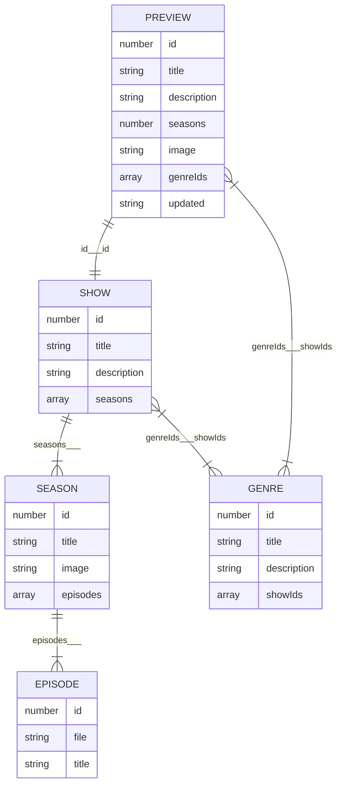

## Overview

Welcome to the Podcast Player Project! This project was designed to create a comprehensive podcast player application where users can browse, search, and listen to a variety of podcast shows. The app provides a rich user experience with features like sorting, searching, favoriting episodes, and more. Unfortunately, due to time constraints and the complexity of some features, the project remains unfinished. Nevertheless, it offers a strong foundation for further development.The project has been deployed on netlify.

## Technologies Used
- Visual Studio Code (VS Code)
- HTML
- CSS
- JavaScript
- React.js
- Fuse.js (for search functionality)
- react-responsive-carousel (for carousel display)
- Netlify (for deployment)

## Setup Instructions

1. **Clone the Repository**:
   ```bash
   git clone https://github.com/Phillip-tech/Module11_DJS11_PHIBOG534_BCL2401_E02_Phillip-Bogopane_DJS11.git   
   ```

2. **Install Dependencies**:
   Ensure you have Node.js installed, then run:
   ```bash
   npm install
   ```

3. **Run the Application**:
   ```bash
   npm start or npm run dev
   ```
   This will start the application on `http://localhost:3000`.

4. **Deploy to Netlify**:
   Follow [Netlify's documentation](https://docs.netlify.com/site-deploys/create-deploys/) to deploy the app to a custom URL.

 # React + Vite

This template provides a minimal setup to get React working in Vite with HMR and some ESLint rules.

Currently, two official plugins are available:

- [@vitejs/plugin-react](https://github.com/vitejs/vite-plugin-react/blob/main/packages/plugin-react/README.md) uses [Babel](https://babeljs.io/) for Fast Refresh
- [@vitejs/plugin-react-swc](https://github.com/vitejs/vite-plugin-react-swc) uses [SWC](https://swc.rs/) for Fast Refresh

## Usage

### Browsing Podcasts

- **Search**: Use the search bar to find podcasts by title, description, or genre.
- **Sort**: Use the sort dropdown to arrange podcasts by title (A-Z, Z-A) or by the date they were last updated.Due to glitch if you select season in dropdown list,refresh browser to be able to use text input filters,fuzzy matching and sorting dropdown list.

### Listening to Podcasts

- **Play Episodes**: Click on a podcast to view its details and play episodes using the built-in audio player.
- **Favorite Episodes**: Click the 'Favorite' button to mark episodes as favorites for easy access later.

### Managing Favourites

- **View Favourites**: Access a list of your favorite episodes from the favorites section.
- **Remove Favourites**: Click the 'Unfavorite' button to remove episodes from your favorites.

### Persistence

- **Local Storage**: The app saves listened episodes and favorites to local storage, so your data is retained between sessions.

**Styling Elements**: The styling is managed using basic CSS, and the layout is designed to be responsive, ensuring a good user experience across different devices.

## Challenges Faced

The code initially faced several challenges, including:

- **API Integration**: Handling asynchronous data fetching and ensuring all data structures were correctly processed.
- **Search Functionality**: Implementing Fuse.js for fuzzy search to enhance user experience.
- **State Management**: Managing state for the selected podcast, favorite episodes, and audio player progress.
- **User Interface**: Designing an intuitive and responsive UI with React components.

### Areas for Improvement

- **Completion of User Stories**: Many core and stretch goals from the user stories remain incomplete, such as filtering shows by genre, arranging favorites by various criteria, and ensuring cross-device compatibility.
- **Advanced Features**: Implementing features like a sliding carousel on the landing page, text input filters, and fuzzy matching for concepts.
- **Performance Optimization**: Optimizing data fetching and state updates to ensure smooth performance.

## Reflections

Starting this project was a learning experience, highlighting the complexities of building a fully functional web application from scratch. Balancing the various aspects of development, from state management to UI design, was challenging but rewarding. This project provided valuable insights into React and modern web development practices, even though it remains incomplete. Future work will focus on completing the remaining features and refining the existing ones to deliver a polished product.

## 🤖 Technology

**React and Build-Process**: The project is primarily built using React, leveraging its component-based architecture to manage the complexity involved. The build process is managed using tools like Webpack and Babel, ensuring modern JavaScript features and optimized builds.

## 📦Data

**Data Units**:

- `SHOW`: Contains multiple `SEASON`.
- `SEASON`: A collection of `EPISODE`.
- `EPISODE`: An individual podcast file.

Additional data exposed via the API includes `PREVIEW` and `GENRE` information.

### Relationships

The relationships between data units are illustrated in the following Entity Relationship Diagram:



### Endpoints

Data can be fetched via the following endpoints:
- `https://podcast-api.netlify.app`: Returns an array of PREVIEW.
- `https://podcast-api.netlify.app/genre/<ID>`: Returns a GENRE object.
- `https://podcast-api.netlify.app/id/<ID>`: Returns a SHOW object with embedded SEASON and EPISODE objects.

### Genre Titles

Genre ID to title mapping:
| ID | Title |
| --- | --- |
| 1 | Personal Growth |
| 2 | Investigative Journalism |
| 3 | History |
| 4 | Comedy |
| 5 | Entertainment |
| 6 | Business |
| 7 | Fiction |
| 8 | News |
| 9 | Kids and Family |

## 🧑 User Stories

For detailed user stories and project requirements, please refer to the project rubric. The core requirements include setting up and deploying the project, ensuring a user-friendly interface, managing state effectively, and providing a seamless audio playback experience.

## Contact

For any inquiries or further information, please reach out to me at [your email address]. You can also find more of my projects on my [GitHub profile](https://github.com/Phillip-tech). 

Link[https://podcastavenue.netlify.app]

Thank you for checking out the Podcast Player Project!